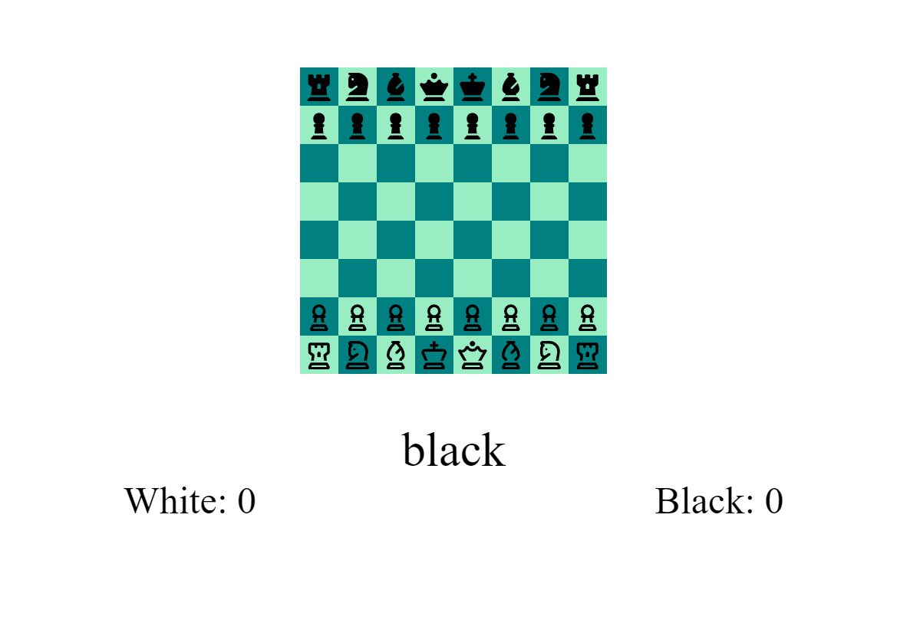

# chess-game
a chess game using vanilla javascript, HTML, and CSS

Current Functionality

1. Movement logic for pieces
1. Logic for validating moves
1. Points Table
1. display current player
1. Single Player
1. Drag and Drop pieces

To be implemented:

1. checkmate
1. check
1. Pinning pieces
1.  En passant
1. Reset
1. fix to have white as first player
1. Stopwatch

